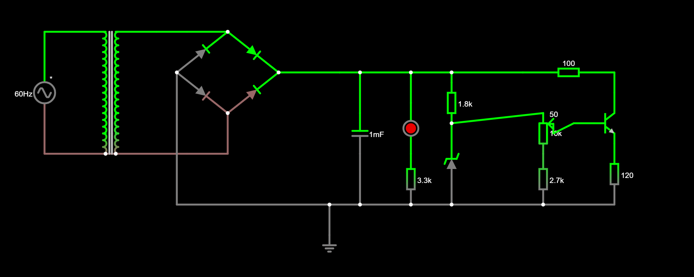
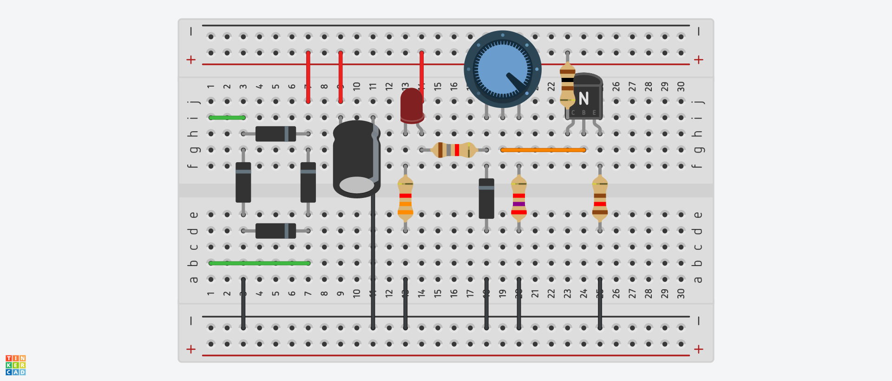
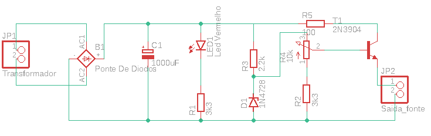
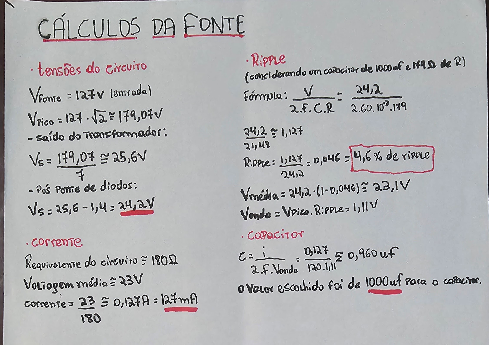

# Fonte de Tensão Ajustável
Rafael Perez Carmanhani - 15485420

## Sobre o Projeto
Este projeto é um sistema desenvolvido para a disciplina de Eletrônica para Computação na USP - São Carlos. O objetivo é montar uma fonte com tensão ajustável entre 3V e 12V, com capacidade de corrente de até 100mA.

## Circuito no Falstad

Link para o circuito: https://tinyurl.com/29hzvqvx

## Projeto no Tinkercad

## Componentes utilizados

| Quantidade | Componente           | Valor Individual (R$) | Valor Total (R$) |
|------------|----------------------|-----------------------|------------------|
| 1          | Protoboard           | 25,00                 | 25,00            |
| 1          | Capacitor 1000uF 25V | 1,60                  | 3,20             |
| 2          | LED Vermelho         | 1,00                  | 2,00             |
| 20         | Fios Jumper          | 1,00                  | 20,00            |
| 1          | Potenciometro 10k    | 3,00                  | 3,00             |
| 13         | Resistores           | 0,15                  | 1,95             |
| 2          | Ponte Retificadora   | 4,00                  | 8,00             |
| 2          | Diodo Zener          | 0,80                  | 1,60             |
| 3          | Transistor           | 0,60                  | 1,80             |
|            | **Total**            |                       | **67,60**       |

## Esquemático no Eagle

## PCB no Eagle
pcb

## Vídeo do Projeto Funcionando
vídeo

## Cálculos

